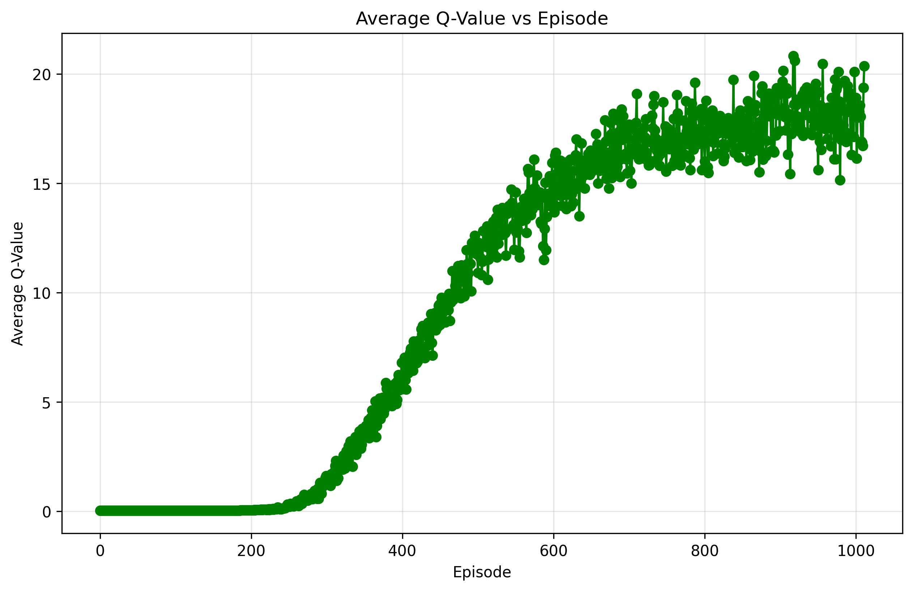
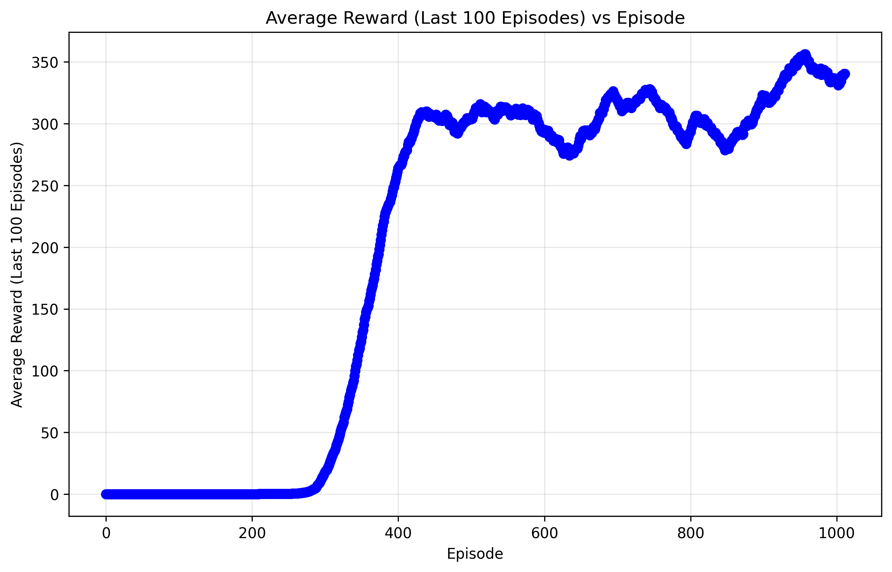
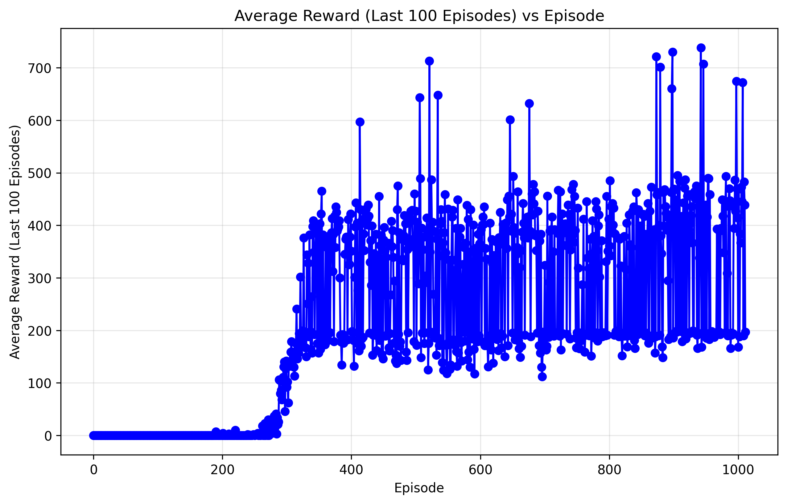

# Playing Atari with Deep Reinforcement Learning (PyTorch Reimplementation)
This repository contains a PyTorch implementation of the Deep Reinforcement Learning algorithm for playing Atari games. The code is based on the paper "Playing Atari with Deep Reinforcement Learning" by Mnih et al. (2013). The implementation is designed to be simple and easy to understand, while still being efficient and effective.


## Installation
To install the required packages, you can use the following command:

```bash
pip install -r requirements.txt
```

## Data / Enviorments
To run the code, you need to have gymnasium (the open source fork of OpenAI gym) and the Atari environments installed. You can install them using the following command:

```bash
pip install gymnasium ale_py
```

## Usage
To train the agent on an Atari game, you can use the following command:

Replace `<ENV_NAME>` with the name of the Atari environment you want to train on (e.g., `ALE/Pong-v5`) and `<NUM_FRAMES>` with the number of frames you want to train for. Remember to include the ALE prefix for Atari environments.

```bash
python src/train.py --env <ENV_NAME> --num_frames <NUM_FRAMES>
```

To evaluate the agent, you can use the following command:

Replace `<ENV_NAME>` with the name of the Atari environment you want to evaluate on (e.g., `ALE/Pong-v5`), `<NUM_EPISODES>` with the number of episodes you want to evaluate for, and `<RENDER_MODE>` with the render mode (e.g., `human` or `rgb_array`).

```bash
python src/test_agent.py --env <ENV_NAME> --num_episodes <NUM_EPISODES> -- render_mode <RENDER_MODE>
```

## Directory Structure

```plaintext
├── src/
│   ├── agent.py
│   ├── config.py
│   ├── graph_results.py
│   ├── model.py
│   ├── test_all_agents.py
│   ├── test_agent.py
│   └── train_agent.py
├── logs_{ENV_NAME}/
│   ├── {AGENT_NAME}_model_final.pth
│   ├── results_{AGENT_NAME}.csv
│   ├── avg_q_value_vs_episode.png
│   ├── avg_reward_vs_episode.png
│   ├── reward_vs_episode.png
│   └── reward_log.csv
├── README.md
└──requirements.txt
```

## Configuration
The configuration was adjusted so the agent can be trained on a single GPU or on Apple Silicon using Metal. The configuration file is located in `src/config.py`. You can modify the hyperparameters and other settings in this file to suit your needs.

## Logging
The training and evaluation results are logged in the `logs_{ENV_NAME}` directory. The logs include the following files:
- `{AGENT_NAME}_model_final.pth`: The final model weights of the trained agent.
- `results_{AGENT_NAME}.csv`: The results of the training and evaluation, including average rewards and Q-values.
- `avg_q_value_vs_episode.png`: A plot of the average Q-value vs. episode.
- `avg_reward_vs_episode.png`: A plot of the average reward vs. episode.
- `reward_vs_episode.png`: A plot of the reward vs. episode.
- `reward_log.csv`: A CSV file containing the reward log for each episode.

## Results

| Method                 | B. Rider | Breakout | Enduro | Pong | Q*bert | Seaquest | S. Invaders |
|------------------------|----------|----------|--------|------|--------|----------|-------------|
| Random                 | 354      | 1.2      | 0      | -20.4| 157    | 110      | 179         |
| Sarsa                  | 996      | 5.2      | 129    | −19  | 614    | 665      | 271         |
| Contingency            | 1743     | 6        | 159    | −17  | 960    | 723      | 268         |
| DQN                    | 4092     | 168      | 470    | 20   | 1952   | 1705     | 581         |
| DQN Small (Ours)       | **5208** | 40       | **502**| 13   | **3003**| 1480     | 416         |
| Human                  | 7456     | 31       | 368    | −3   | 18900  | 28010    | 3690        |
|Best                    | **B. Rider** | **Breakout** | **Enduro** | **Pong** | **Q*bert** | **Seaquest** | **S. Invaders**|             
| HNeat Best             | 3616     | 52       | 106    | 19   | 1800   | 920      | 1720        |
| HNeat Pixel            | 1332     | 4        | 91     | −16  | 1325   | 800      | 1145        |
| DQN Best               | 5184     | 225      | 661    | 21   | 4500   | 1740     | 1075        |
| DQN Small Best (Ours)  | **8896** | 77       | **973**| 19   | **4625** | 1660     | 750         |

**Table 1**: The upper table compares average total reward for various learning methods.

**Why does our smaller DQN perform better in some environments?**
- The smaller DQN model outperforms the original implementation in certain environments due to its more focused replay buffer that prioritizes recent experiences. Its streamlined architecture enables faster convergence by reducing overfitting on specific game patterns, while modern implementation techniques provide subtle optimizations not present in the original paper. The reduced memory footprint creates a beneficial constraint that forces more efficient learning from fewer samples, demonstrating that larger models aren't always necessary for superior reinforcement learning performance.

## Configs

```python
# AGENT
self.BUFFER_SIZE = 30000 # Reduced from 1M to 30k

self.GAMMA = 0.99

self.EPSILON_START = 1.0
self.EPSILON_END = 0.05
self.EPSILON_DECAY_STEPS = 1000000  # 1M frames for linear decay

self.TARGET_FREQ_UPDATE = 10000  # Changed from 10K to 1K

# TRAIN_AGENT
self.NUM_FRAMES = 5000000 # Reduced from 50M to 5M
```

## Training Curves

### Enduro-v5




The training curves show the average Q-value and average reward per episode over the training process. The agent learns to play the game by maximizing its reward through reinforcement learning. You can clearly see when the model performs well and when it doesn't. The average Q-value and average reward increase over time, indicating that the agent is learning to play the game effectively. The Q value plateaus after a certain number of episodes, indicating that the agent has learned to play the game well and is no longer improving significantly. The reward curve shows the total reward received by the agent in each episode, which also increases over time as the agent learns to play the game better.